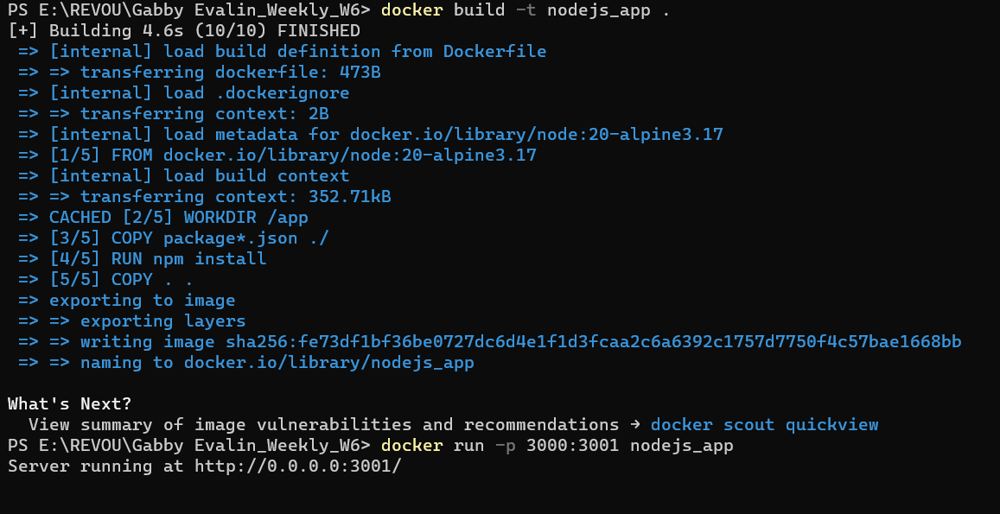
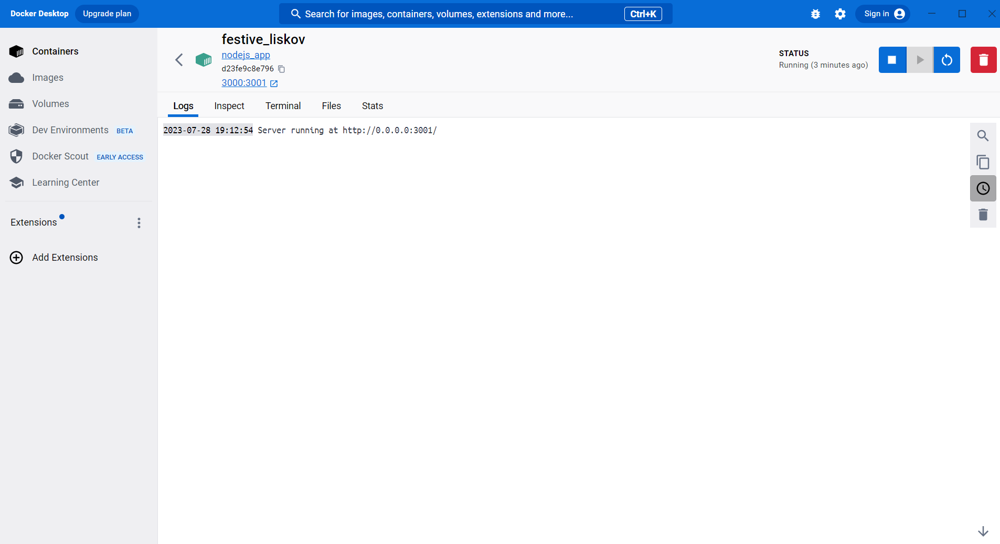

# Sixth Week Assignment: Running Node.js Inside a Docker Container

## Installing Docker on Your Machine (example for windows)
1. Go to the Docker website: https://www.docker.com/products/docker-desktop
2. Download the Docker Desktop installer for Windows.
3. Double-click the installer to start the installation process.
4. Follow the on-screen instructions to install Docker Desktop.
5. Once the installation is complete, Docker Desktop should start automatically.

To verify the installation, open a terminal (or command prompt on Windows) and run the following command:

``` docker --version ```

If Docker is installed correctly, you should see the version number displayed in the terminal.


## Pulling a Docker Image
1. You can search for Docker images on Docker Hub (https://hub.docker.com/) or any other container registry to find the image you want. For example, if you want to pull the official Node.js image, the name would be node.
2. Open a Terminal (or Command Prompt)
3. Use the docker pull command followed by the image name and optional tag (version) to pull the Docker image. If the tag is not specified, it will default to latest.

``` docker:pull node:version ```

4. Verify the Pulled Image:

To verify that the image has been pulled successfully, you can use the following command to list all the images on your local machine:

``` docker images ```


## Dockertizing a Node.js Project without Installing Node on Your Machine

To dockertize a Node.js project, you'll need to create a Dockerfile that defines the container's configuration and then use Docker to build the image and run the container.

1. Create a file named dockerfile in the root of your Node.js project directory with the following contents:

``` 
# Use the official Node.js image as the base image
FROM node:latest

# Set the working directory inside the container
WORKDIR /app

# Copy package.json and package-lock.json to the container
COPY package*.json ./

# Install Node.js dependencies
RUN npm install

# Copy the rest of the application code to the container
COPY . .

# Expose the port your Node.js app listens on
EXPOSE 3000

# Command to start your Node.js app
CMD ["node", "app.js"] 
```

2. Build the docker image
Run the following command to build the Docker image:

``` docker build . -t nodejs_app  ```


3. Run the Docker Container:

After the image is built, you can run a container based on the image using the following command:

``` docker run -d -p 3002:3000 nodejs_app ```

The -d flag runs the container in detached mode (in the background). The -p flag maps port 3000 from the container to port 3000 on your host machine.

4. Access Your Node.js Application:

The Node.js application should now be running inside the Docker container. It can be accessed in your web browser by visiting http://localhost:3000.

